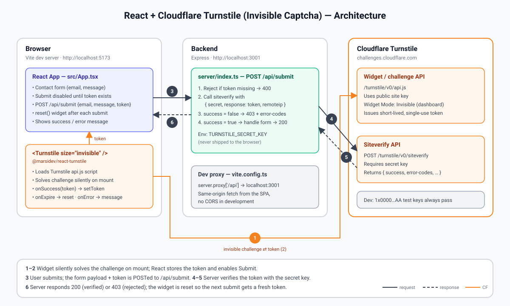

# React + Cloudflare Turnstile (invisible captcha)

A minimal React (Vite + TypeScript) form protected by Cloudflare Turnstile in
**invisible** mode, with an Express API that verifies the token server-side via
the `siteverify` endpoint.

## Run

```bash
npm install
cp .env.example .env   # optional: add your real keys
npm run dev            # frontend on :5173, API on :3001
```

Without a `.env`, Cloudflare's test keys are used (always pass, no real challenge).

## Real keys

1. Cloudflare dashboard → Turnstile → Add widget.
2. Set **Widget Mode** to *Invisible* and add your hostname(s) (`localhost` for dev).
3. Put the site key in `VITE_TURNSTILE_SITE_KEY` and the secret in `TURNSTILE_SECRET_KEY`.

## Architecture



## How it works

- `src/App.tsx` renders `<Turnstile size="invisible">` from `@marsidev/react-turnstile`.
  It runs the challenge on load and calls `onSuccess(token)`; the submit button is
  enabled once a token exists. After each submit the widget is reset (tokens are single-use).
- `server/index.ts` receives `{ token, ... }` at `POST /api/submit` and calls
  `https://challenges.cloudflare.com/turnstile/v0/siteverify` with the secret key.
  Only verified requests are processed.
- `vite.config.ts` proxies `/api` to the Express server in dev.
