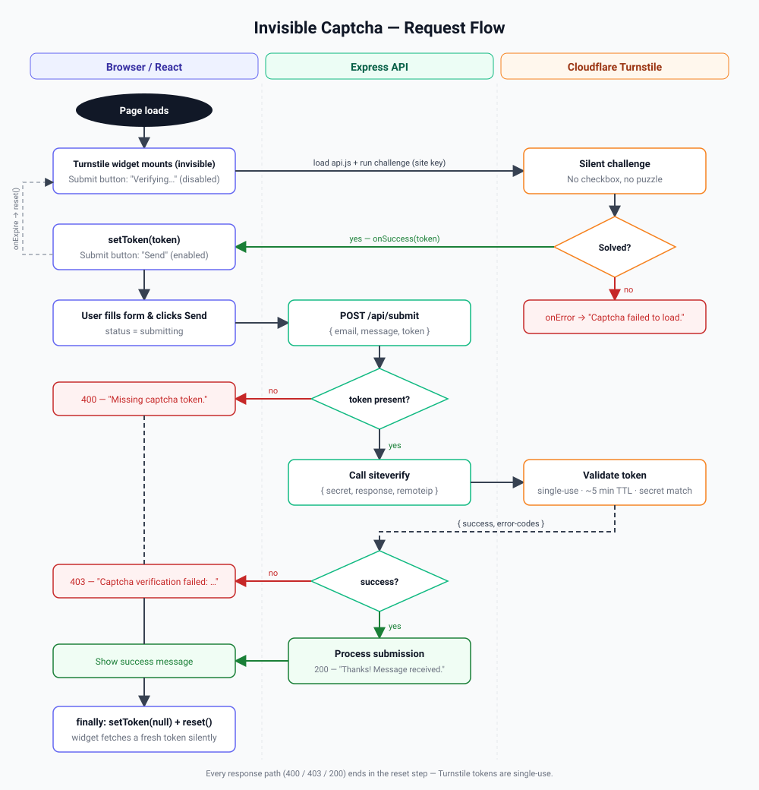

# Solution Document — React + Cloudflare Turnstile Invisible Captcha

| | |
|---|---|
| **Project** | turnstile-invisible-captcha |
| **Repository** | https://github.com/tunagauda2022/turnstile-invisible-captcha |
| **Version** | 1.0 |
| **Date** | 2026-09-21 |
| **Status** | Implemented |

---

## 1. Executive Summary

Public web forms (contact, signup, login) attract bots that submit spam or abuse backend resources. Traditional CAPTCHAs stop bots but frustrate real users with puzzles and checkboxes.

This solution protects a React form with **Cloudflare Turnstile in invisible mode**: the visitor sees no challenge at all, a token is generated silently in the background, and the backend validates that token with Cloudflare before processing the request. The result is bot protection with zero user friction.

## 2. Goals and Non-Goals

**Goals**

- Block automated form submissions without any visible challenge.
- Enforce verification on the **server**, never trusting the client alone.
- Keep secrets (Turnstile secret key) out of the browser bundle.
- Provide a minimal, reusable reference implementation in React + TypeScript.
- Work out-of-the-box locally with Cloudflare's test keys.

**Non-Goals**

- Persisting form submissions (database / email) — left as an integration point.
- Rate limiting, WAF, or other layered protections (recommended in production, see §9).
- Authentication / user accounts.

## 3. Requirements

### Functional

| ID | Requirement |
|----|-------------|
| F1 | The form must render without any visible captcha widget. |
| F2 | The Submit button is disabled until a Turnstile token is available. |
| F3 | The token is sent with the form payload to the backend. |
| F4 | The backend rejects requests with a missing (400) or invalid (403) token. |
| F5 | On success the backend returns 200 and the UI shows a confirmation. |
| F6 | After every submission the widget is reset so a fresh token is obtained. |
| F7 | Expired tokens are transparently refreshed. |

### Non-Functional

| ID | Requirement |
|----|-------------|
| N1 | Secret key exists only in server environment variables. |
| N2 | No CAPTCHA-related UI interaction required from the user. |
| N3 | TypeScript strict mode; lint and build must pass. |
| N4 | Runs locally with a single `npm run dev`. |

## 4. Technology Stack

| Layer | Technology | Purpose |
|-------|-----------|---------|
| Frontend | React 19, TypeScript, Vite 8 | SPA and dev server |
| Captcha (client) | `@marsidev/react-turnstile` | React wrapper around Turnstile `api.js` |
| Backend | Node 22, Express 5, `tsx` | JSON API, server-side verification |
| Captcha (server) | Cloudflare `siteverify` REST API | Token validation |
| Tooling | `concurrently`, `oxlint`, `tsc` | Run both servers, lint, type-check |

## 5. Architecture


### 5.1 Components

**React App — `src/App.tsx`**
Renders a contact form (email, message) and a `<Turnstile size="invisible" />` widget. Holds `token` state; the Submit button reads `"Verifying…"` (disabled) until `onSuccess(token)` fires, then `"Send"`. On submit it POSTs `{ email, message, token }` to `/api/submit`, displays the result, and in a `finally` block clears the token and calls `turnstileRef.current.reset()`.

**Turnstile widget — `@marsidev/react-turnstile`**
Injects `https://challenges.cloudflare.com/turnstile/v0/api.js`, renders the widget with `size: "invisible"`, and runs the challenge on mount. Callbacks used: `onSuccess`, `onExpire`, `onError`.

**Express API — `server/index.ts`**
Single route `POST /api/submit`. Validates the token by POSTing `{ secret, response, remoteip }` to `https://challenges.cloudflare.com/turnstile/v0/siteverify`. Responds 400 (no token), 403 (verification failed, includes Cloudflare `error-codes`), or 200 (verified).

**Vite dev proxy — `vite.config.ts`**
Proxies `/api/*` from `:5173` to `:3001` so the SPA uses same-origin requests in development.

**Cloudflare Turnstile**
Managed service. The widget is created in the Cloudflare dashboard with **Widget Mode = Invisible** and the allowed hostnames. It provides a public **site key** (browser) and a **secret key** (server).

### 5.2 Request Flow



1. Page loads → widget mounts and silently runs the challenge.
2. Cloudflare returns a token → `onSuccess` → Submit enabled. (`onExpire` resets and re-runs.)
3. User submits → `POST /api/submit` with payload + token.
4. Server calls `siteverify` with secret key + token (+ client IP).
5. Cloudflare returns `{ success, error-codes, hostname, challenge_ts }`.
6. Server returns 200 or 403 → UI shows message → widget reset for the next submission.

## 6. Security Design

| Concern | Mitigation |
|---------|-----------|
| Client-side bypass | Verification is performed server-side; a request without a valid token is rejected regardless of UI state. |
| Secret leakage | `TURNSTILE_SECRET_KEY` is read from server env only; only `VITE_TURNSTILE_SITE_KEY` (public by design) is bundled. |
| Token replay | Turnstile tokens are single-use and expire after ~5 minutes; `siteverify` rejects reuse (`timeout-or-duplicate`). The client resets after each submit. |
| Token from another site | `siteverify` returns the `hostname`; production code may assert it matches the expected domain. |
| IP mismatch | `remoteip` is forwarded to `siteverify` for additional correlation. |
| Dependency on CF availability | `onError` surfaces a clear message; consider a fallback policy (fail-closed by default). |

## 7. Configuration

| Variable | Where | Default | Description |
|----------|-------|---------|-------------|
| `VITE_TURNSTILE_SITE_KEY` | Frontend (`.env`) | `1x00000000000000000000AA` (test, always passes) | Public site key |
| `TURNSTILE_SECRET_KEY` | Backend (`.env`) | `1x0000000000000000000000000000000AA` (test, always passes) | Secret key for `siteverify` |
| `PORT` | Backend | `3001` | API port |

Other useful Cloudflare test keys: `2x…AA` (always blocks), `3x…AA` (forces interactive challenge).

Obtaining real keys: Cloudflare Dashboard → Turnstile → *Add widget* → mode **Invisible** → add hostnames (include `localhost` for development).

## 8. Project Structure

```
turnstile-invisible-captcha/
├─ src/
│  ├─ App.tsx            # form + <Turnstile size="invisible">
│  ├─ App.css / index.css
│  └─ main.tsx
├─ server/
│  └─ index.ts           # Express API, siteverify call
├─ docs/
│  ├─ architecture.svg
│  ├─ flow.svg
│  └─ SOLUTION.md
├─ vite.config.ts        # /api proxy
├─ .env.example
└─ package.json          # dev / build / lint scripts
```

## 9. Deployment Considerations

- **Frontend**: `npm run build` produces static assets in `dist/`; host on any static host or Cloudflare Pages.
- **Backend**: run `server/index.ts` on Node ≥ 20 (or port the handler to Cloudflare Workers / serverless). In production, serve the API on the same origin or configure `cors()` with an explicit origin allow-list.
- **Secrets**: inject `TURNSTILE_SECRET_KEY` via the platform's secret manager; never commit `.env`.
- **Hardening**: add rate limiting, request-size limits, and hostname assertion on the `siteverify` response. Consider Cloudflare WAF/Bot Management in front of the API.
- **Observability**: log `error-codes` from failed verifications to monitor abuse and misconfiguration.

## 10. Testing and Verification

| Check | Command / Method | Result |
|-------|------------------|--------|
| Lint | `npm run lint` | Pass |
| Type-check + build | `npm run build` | Pass |
| API happy path | `curl -X POST /api/submit` with test token | 200 `{ success: true }` |
| End-to-end (browser) | Load page, fill form, Submit becomes enabled, submit → success message | Pass |
| Negative path | Use `2x…AA` test keys or omit token | 403 / 400 as expected |

## 11. Future Enhancements

- Persist submissions (database, email, CRM webhook).
- Assert `hostname` and `action`/`cdata` from `siteverify` for stronger binding.
- Add automated tests (Vitest for UI, supertest for API) with mocked `siteverify`.
- Support `execution: "execute"` to run the challenge only on submit instead of on mount.
- Deploy backend as a Cloudflare Worker for end-to-end Cloudflare hosting.

## 12. References

- Turnstile docs: https://developers.cloudflare.com/turnstile/
- Client-side rendering / invisible mode: https://developers.cloudflare.com/turnstile/get-started/client-side-rendering/
- Server-side validation: https://developers.cloudflare.com/turnstile/get-started/server-side-validation/
- Testing keys: https://developers.cloudflare.com/turnstile/troubleshooting/testing/
- `@marsidev/react-turnstile`: https://github.com/marsidev/react-turnstile
